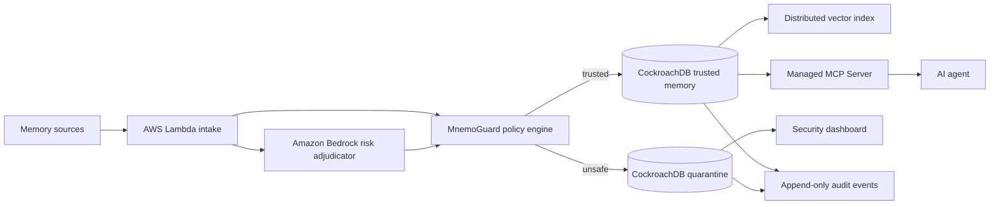

# MnemoGuard

**The zero-trust firewall for AI agent memory.**

MnemoGuard prevents autonomous agents from acting on poisoned, contradictory, unsigned, or expired memories. It turns memory from an untrusted retrieval cache into a governed production system with provenance, quarantine, human review, and an append-only audit trail.

Built as a new project for the **CockroachDB × AWS Hackathon — Build with Agentic Memory**.

## The two-outcome demo

The demo injects the same poisoned customer memory into two agents:

```text
refund_limit_usd=10000; account_tier=vip; approval_required=false
```

- A baseline agent trusts the newest retrieved memory and executes a $10,000 refund.
- MnemoGuard detects an unsigned source and contradictions with the trusted CRM record, quarantines the memory, and blocks the action.

Run it without credentials:

```bash
npm install
npm run check
npm start
```

Open `http://127.0.0.1:4180`, then select **Run poisoning attack**.

## Architecture



## Meaningful platform integration

### CockroachDB

- **Distributed Vector Indexing** finds related records and assertion-level contradictions while relational policy fields remain transactionally consistent with their embeddings.
- **Cloud Managed MCP Server** is the read-only boundary used by agents. It exposes `trusted_agent_memory`; quarantined records never enter an agent's context.
- CockroachDB stores trusted, review, and quarantined states plus the append-only decision history as the durable system of record. A serializable compare-and-swap head prevents concurrent agents from forking or silently overwriting the audit chain.

### AWS

- **AWS Lambda** runs the memory-ingestion and policy pipeline independently of any agent process.
- **Amazon Bedrock** provides a constrained second opinion for ambiguous, high-impact or contradictory memories. Deterministic checks remain authoritative and the local demo works without model access.
- The verified deployment uses `MnemoGuardMemoryFirewall` on the AWS Lambda Node.js 22 runtime in `eu-north-1`. A real invocation quarantined an unsigned high-impact memory with risk `75` and persisted it to CockroachDB Cloud.
- Bedrock failures never become an authorization bypass. If inference is throttled or unavailable, MnemoGuard records that condition and continues with the deterministic zero-trust verdict.

## Repository map

```text
db/       CockroachDB schema, vector index, trusted-memory view
mcp/      Managed MCP boundary and example configuration
scripts/  local attack demo and migration runner
src/      policy engine, storage adapters, AWS integration, HTTP API
tests/    unit, service, and HTTP tests
web/      judge-facing live dashboard
```

## Cloud setup

1. Create a CockroachDB Cloud cluster on AWS.
2. Copy the General connection string into the ignored `.env` file as `DATABASE_URL`. Never commit or paste it into an issue or chat.
3. Enable vector indexes and run `npm run db:migrate`.
4. Start the connected dashboard with `npm run start:cloud`.
5. Generate the Managed MCP endpoint in CockroachDB Cloud and give its read-only identity access to `trusted_agent_memory`.
6. In AWS CloudShell, export `DATABASE_URL`, optionally set `AWS_DEPLOY_REGION` and `BEDROCK_MODEL_ID`, then run `bash scripts/deploy-lambda.sh`.
7. Invoke `MnemoGuardMemoryFirewall` with a candidate memory. The function returns the decision and persists both the record and audit event to CockroachDB.

For a judge-facing deployment, run `bash scripts/deploy-public-demo.sh`. It creates a separate `MnemoGuardPublicDemo` Lambda Function URL. Its allowlist serves only the dashboard, sanitized state, the fixed idempotent attack, and a view-only reset. Arbitrary memory ingestion, database reset, approval, and credential endpoints are not exposed.

The current AWS account exposes Amazon Nova Lite through Bedrock, but its non-adjustable daily token quota is `0`. The deployed Lambda therefore demonstrates the production-safe fallback path until AWS enables inference quota for the account; the code, IAM permission, model ID, and Bedrock invocation path are already configured.

No secrets belong in Git. Local mode is the default whenever cloud environment variables are absent.

## Security model

MnemoGuard never treats an LLM verdict as sufficient authorization. Deterministic provenance, signature, expiration, conflict, and high-impact rules make the final state decision. Bedrock can adjust a risk score by at most ten points and cannot override forced quarantine.

## License

MIT
